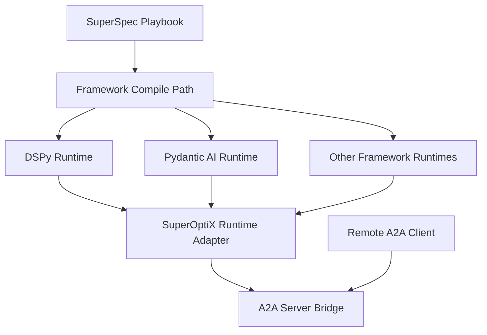

# A2A Introduction

Agent2Agent, or A2A, is an interoperability protocol for agents.

In SuperOptiX, A2A is the protocol layer used to:

- expose SuperOptiX-built agents as A2A-compatible servers
- discover and call remote A2A agents
- keep framework-specific runtime details behind SuperOptiX-owned adapters

This matters because SuperOptiX already supports multiple agent frameworks. A2A gives those agents a common interoperability surface without forcing them into the same framework runtime.

## A2A v1 Changes In SuperOptiX

In plain terms, SuperOptiX now speaks the newer A2A v1 protocol shape.

That means:

- SuperOptiX agents can introduce themselves using the newer v1 Agent Card format
- SuperOptiX can call other A2A agents using the newer v1 method names
- task states and message roles now follow the v1 naming model
- the CLI and demo flows use the same v1 A2A bridge

So if you are using A2A with SuperOptiX today, you are using the core A2A v1 interoperability model, not the older 0.3-style protocol shape.

## What A2A Means in SuperOptiX

SuperOptiX treats A2A as a protocol, not as a framework.

That means:

- DSPy, Pydantic AI, OpenAI SDK, CrewAI, Google ADK, DeepAgents, and other frameworks remain separate build targets
- A2A sits above them as a communication and exposure layer
- the A2A bridge talks to a framework-neutral runtime contract in `superoptix/runtime/`

Conceptually:



## Why Use A2A

Use A2A when you want:

- one agent to call another agent as an agent, not just as a raw tool
- framework-neutral exposure of SuperOptiX agents
- remote capability discovery through Agent Cards
- blocking or task-based agent-to-agent workflows

Use MCP when you want:

- tool discovery
- context/tool server integration
- protocol-driven tool use

MCP and A2A are complementary:

- MCP: agent to tool/context server
- A2A: agent to agent

## Design Rules in This Repo

Runtime A2A support in SuperOptiX follows these rules:

- SuperOptiX implements the A2A wire protocol directly, over FastAPI
- the `a2a-sdk` package is not a dependency and is not imported
- conformance is verified against the official Technology Compatibility Kit
  rather than asserted

See the decision record:

- [ADR 0001: A2A Integration Boundary](../adrs/0001-a2a-integration-boundary.md)

## Protocol versions

SuperOptiX targets A2A `1.0` and also serves the `0.3` line. A client selects
with the `A2A-Version` request header; `1.0` is assumed when it is absent.

Official release announcement:

- [Announcing A2A 1.0](https://a2a-protocol.org/latest/announcing-1.0/)

Both lines are served because the installed base is on 0.3. Of the eight agent
frameworks SuperOptiX adapts, five declare no A2A dependency and the three that
do are pinned below 1.0.

Conformance is measured, not claimed. See
[A2A conformance](a2a-conformance.md) for current results and how to reproduce
them.

This is exposed through the optional package extra:

```bash
pip install "superoptix[a2a]"
```

## Current SuperOptiX A2A Scope

Available now:

- native A2A integration package in `superoptix/protocols/a2a/`
- framework-neutral runtime layer in `superoptix/runtime/`
- A2A Agent Card builder
- A2A server bootstrap for SuperOptiX pipelines
- A2A client wrapper for calling remote agents
- packaged DSPy demo
- packaged Pydantic AI demo

Not complete yet:

- richer Agent Card security and signatures
- full cross-framework demo with DSPy + Pydantic AI + CrewAI + ADK talking to each other
- advanced streaming and push notification demo flows

## Main Components

Relevant modules:

- `superoptix/runtime/base.py`
- `superoptix/runtime/registry.py`
- `superoptix/runtime/adapters/pipeline.py`
- `superoptix/protocols/a2a/card_builder.py`
- `superoptix/protocols/a2a/mappers.py`
- `superoptix/protocols/a2a/server.py`
- `superoptix/protocols/a2a/client.py`

## Next Reading

- [A2A Guide](a2a-guide.md)
- [A2A Demo Guide](a2a-demo-guide.md)
