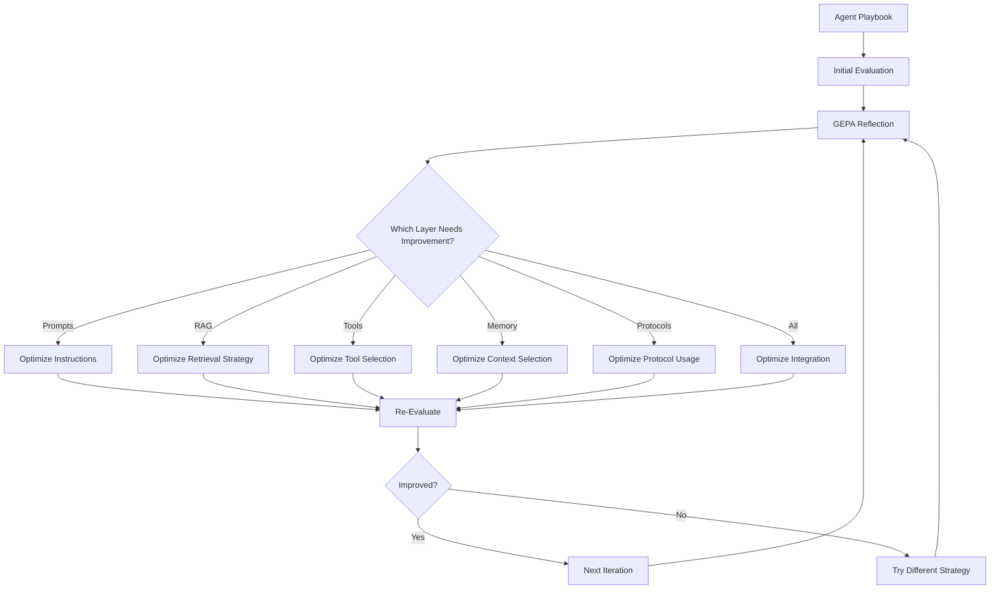

# Agent Optimization: Beyond Prompts

## What is Agent Optimization?

Agent optimization is the process of improving an AI agent's performance across **all layers** of the agentic pipeline, not just prompts. While traditional approaches focus solely on prompt engineering, SuperOptiX optimizes the entire stack: prompts, RAG retrieval, tool usage, memory selection, protocol handling, and dataset-driven learning.

**Key Insight**: A production-ready agent requires optimization at every layer. Optimizing only prompts while leaving other layers unoptimized is like tuning a car's engine while ignoring the transmission, brakes, and steering.

---

## The Problem with Prompt-Only Optimization

Traditional AI optimization focuses exclusively on prompt engineering:

<table style="width: 100%; border-collapse: collapse; margin: 20px 0;">
	<tr style="background: rgba(255, 0, 0, 0.1);">
		<td style="padding: 15px; border: 2px solid rgba(255, 0, 0, 0.3);">
			<h4 style="color: #CC0000; margin-top: 0;">❌ Traditional Approach</h4>
			<p><strong>What Gets Optimized:</strong></p>
			<ul>
				<li>Prompt instructions only</li>
			</ul>
			<p><strong>What's Ignored:</strong></p>
			<ul>
				<li>When to retrieve knowledge (RAG)</li>
				<li>Which tools to use</li>
				<li>How to select relevant memories</li>
				<li>How to combine information</li>
			</ul>
			<p><strong>Result:</strong> Suboptimal performance, manual tuning required for each layer</p>
		</td>
	</tr>
</table>

**Example Problem**: An agent might have a perfect prompt for code review, but if it doesn't know WHEN to search security documentation or WHICH analysis tools to use, it will still produce mediocre results.

---

## The SuperOptiX Full-Stack Approach

SuperOptiX optimizes **6 distinct layers** of the agentic pipeline:

<table style="width: 100%; border-collapse: collapse; margin: 20px 0;">
	<tr style="background: rgba(76, 175, 80, 0.15); font-weight: bold;">
		<td style="padding: 15px; border: 2px solid rgba(128, 128, 128, 0.3);">Layer</td>
		<td style="padding: 15px; border: 2px solid rgba(128, 128, 128, 0.3);">Traditional Approach</td>
		<td style="padding: 15px; border: 2px solid rgba(128, 128, 128, 0.3);">SuperOptiX Approach</td>
		<td style="padding: 15px; border: 2px solid rgba(128, 128, 128, 0.3);">Impact</td>
	</tr>
	<tr style="background: rgba(156, 39, 176, 0.05);">
		<td style="padding: 12px; border: 2px solid rgba(128, 128, 128, 0.3);"><strong>💬 Prompts</strong></td>
		<td style="padding: 12px; border: 2px solid rgba(128, 128, 128, 0.3);">Manual tuning</td>
		<td style="padding: 12px; border: 2px solid rgba(128, 128, 128, 0.3);"><strong>GEPA learns optimal instructions</strong></td>
		<td style="padding: 12px; border: 2px solid rgba(128, 128, 128, 0.3);">High</td>
	</tr>
	<tr style="background: rgba(33, 150, 243, 0.05);">
		<td style="padding: 12px; border: 2px solid rgba(128, 128, 128, 0.3);"><strong>🔍 RAG</strong></td>
		<td style="padding: 12px; border: 2px solid rgba(128, 128, 128, 0.3);">Fixed retrieval</td>
		<td style="padding: 12px; border: 2px solid rgba(128, 128, 128, 0.3);"><strong>GEPA learns retrieval strategy</strong></td>
		<td style="padding: 12px; border: 2px solid rgba(128, 128, 128, 0.3);">High</td>
	</tr>
	<tr style="background: rgba(255, 152, 0, 0.05);">
		<td style="padding: 12px; border: 2px solid rgba(128, 128, 128, 0.3);"><strong>🛠️ Tools</strong></td>
		<td style="padding: 12px; border: 2px solid rgba(128, 128, 128, 0.3);">Hardcoded selection</td>
		<td style="padding: 12px; border: 2px solid rgba(128, 128, 128, 0.3);"><strong>GEPA learns tool selection</strong></td>
		<td style="padding: 12px; border: 2px solid rgba(128, 128, 128, 0.3);">Medium</td>
	</tr>
	<tr style="background: rgba(76, 175, 80, 0.05);">
		<td style="padding: 12px; border: 2px solid rgba(128, 128, 128, 0.3);"><strong>🧠 Memory</strong></td>
		<td style="padding: 12px; border: 2px solid rgba(128, 128, 128, 0.3);">All memories included</td>
		<td style="padding: 12px; border: 2px solid rgba(128, 128, 128, 0.3);"><strong>GEPA optimizes context selection</strong></td>
		<td style="padding: 12px; border: 2px solid rgba(128, 128, 128, 0.3);">High</td>
	</tr>
	<tr style="background: rgba(156, 39, 176, 0.05);">
		<td style="padding: 12px; border: 2px solid rgba(128, 128, 128, 0.3);"><strong>🔌 Protocols (MCP)</strong></td>
		<td style="padding: 12px; border: 2px solid rgba(128, 128, 128, 0.3);">Static patterns</td>
		<td style="padding: 12px; border: 2px solid rgba(128, 128, 128, 0.3);"><strong>GEPA adapts protocol usage</strong></td>
		<td style="padding: 12px; border: 2px solid rgba(128, 128, 128, 0.3);">Medium</td>
	</tr>
	<tr style="background: rgba(33, 150, 243, 0.05);">
		<td style="padding: 12px; border: 2px solid rgba(128, 128, 128, 0.3);"><strong>📊 Datasets</strong></td>
		<td style="padding: 12px; border: 2px solid rgba(128, 128, 128, 0.3);">Small manual examples</td>
		<td style="padding: 12px; border: 2px solid rgba(128, 128, 128, 0.3);"><strong>GEPA trains on 100s-1000s examples</strong></td>
		<td style="padding: 12px; border: 2px solid rgba(128, 128, 128, 0.3);">Very High</td>
	</tr>
</table>

---

## How GEPA Optimizes Each Layer

GEPA (Genetic-Pareto) doesn't just optimize prompts. It learns **strategies** for each layer through reflection and iteration:

### The Optimization Process



**Key Feature**: GEPA automatically identifies which layer needs improvement and applies targeted optimizations.

---

## Quick Results Preview

Here's what full-stack optimization looks like in practice:

**Use Case**: Code Review Agent

<table style="width: 100%; border-collapse: collapse; margin: 20px 0;">
	<tr style="background: rgba(33, 150, 243, 0.15); font-weight: bold;">
		<td style="padding: 15px; border: 2px solid rgba(128, 128, 128, 0.3);">Metric</td>
		<td style="padding: 15px; border: 2px solid rgba(128, 128, 128, 0.3);">Before Optimization</td>
		<td style="padding: 15px; border: 2px solid rgba(128, 128, 128, 0.3);">After Optimization</td>
		<td style="padding: 15px; border: 2px solid rgba(128, 128, 128, 0.3);">Improvement</td>
	</tr>
	<tr style="background: rgba(255, 255, 255, 0.05);">
		<td style="padding: 12px; border: 2px solid rgba(128, 128, 128, 0.3);"><strong>Overall Accuracy</strong></td>
		<td style="padding: 12px; border: 2px solid rgba(128, 128, 128, 0.3);">37.5%</td>
		<td style="padding: 12px; border: 2px solid rgba(128, 128, 128, 0.3);"><strong style="color: #4CAF50;">87.5%</strong></td>
		<td style="padding: 12px; border: 2px solid rgba(128, 128, 128, 0.3);"><strong style="color: #4CAF50;">+50%</strong></td>
	</tr>
	<tr style="background: rgba(255, 255, 255, 0.05);">
		<td style="padding: 12px; border: 2px solid rgba(128, 128, 128, 0.3);"><strong>Security Detection</strong></td>
		<td style="padding: 12px; border: 2px solid rgba(128, 128, 128, 0.3);">33%</td>
		<td style="padding: 12px; border: 2px solid rgba(128, 128, 128, 0.3);"><strong style="color: #4CAF50;">100%</strong></td>
		<td style="padding: 12px; border: 2px solid rgba(128, 128, 128, 0.3);"><strong style="color: #4CAF50;">+67%</strong></td>
	</tr>
	<tr style="background: rgba(255, 255, 255, 0.05);">
		<td style="padding: 12px; border: 2px solid rgba(128, 128, 128, 0.3);"><strong>RAG Relevance</strong></td>
		<td style="padding: 12px; border: 2px solid rgba(128, 128, 128, 0.3);">Random</td>
		<td style="padding: 12px; border: 2px solid rgba(128, 128, 128, 0.3);"><strong style="color: #4CAF50;">Strategic</strong></td>
		<td style="padding: 12px; border: 2px solid rgba(128, 128, 128, 0.3);"><strong style="color: #4CAF50;">Contextual</strong></td>
	</tr>
	<tr style="background: rgba(255, 255, 255, 0.05);">
		<td style="padding: 12px; border: 2px solid rgba(128, 128, 128, 0.3);"><strong>Tool Usage</strong></td>
		<td style="padding: 12px; border: 2px solid rgba(128, 128, 128, 0.3);">Wrong/None</td>
		<td style="padding: 12px; border: 2px solid rgba(128, 128, 128, 0.3);"><strong style="color: #4CAF50;">Correct Tools</strong></td>
		<td style="padding: 12px; border: 2px solid rgba(128, 128, 128, 0.3);"><strong style="color: #4CAF50;">100% Accurate</strong></td>
	</tr>
	<tr style="background: rgba(255, 255, 255, 0.05);">
		<td style="padding: 12px; border: 2px solid rgba(128, 128, 128, 0.3);"><strong>Memory Efficiency</strong></td>
		<td style="padding: 12px; border: 2px solid rgba(128, 128, 128, 0.3);">All memories (overflow)</td>
		<td style="padding: 12px; border: 2px solid rgba(128, 128, 128, 0.3);"><strong style="color: #4CAF50;">Optimized selection</strong></td>
		<td style="padding: 12px; border: 2px solid rgba(128, 128, 128, 0.3);"><strong style="color: #4CAF50;">-60% tokens</strong></td>
	</tr>
	<tr style="background: rgba(255, 255, 255, 0.05);">
		<td style="padding: 12px; border: 2px solid rgba(128, 128, 128, 0.3);"><strong>Response Quality</strong></td>
		<td style="padding: 12px; border: 2px solid rgba(128, 128, 128, 0.3);">Vague suggestions</td>
		<td style="padding: 12px; border: 2px solid rgba(128, 128, 128, 0.3);"><strong style="color: #4CAF50;">Actionable solutions</strong></td>
		<td style="padding: 12px; border: 2px solid rgba(128, 128, 128, 0.3);"><strong style="color: #4CAF50;">With code examples</strong></td>
	</tr>
</table>

**Key Observation**: The compound effect of optimizing all layers produces production-ready results.

---

## The Six Optimization Layers

Click on any layer to learn how GEPA optimizes it:

### [💬 Prompt Optimization](prompts.md)

**What Gets Optimized:**
- Persona and role definition
- Task instructions
- Reasoning patterns
- Response formatting

**GEPA Learns:**
- How to structure clear instructions
- When to use chain-of-thought
- How to format comprehensive responses

**Example**: "Provide thorough, actionable code reviews" → "Analyze code for security (SQL injection, XSS), performance (O(n²) complexity), and maintainability (cyclomatic complexity > 4). Provide specific solutions with code examples."

---

### [🔍 RAG Optimization](rag.md)

**What Gets Optimized:**
- When to search knowledge base
- Which documents to retrieve
- How to integrate context
- Relevance scoring

**GEPA Learns:**
- "Search security docs BEFORE analyzing SQL queries"
- "Retrieve performance patterns for loop analysis"
- "Check best practices for naming conventions"

**Example**: From random document retrieval → Strategic, issue-specific retrieval with 85% relevance

---

### [🛠️ Tool Optimization](tools.md)

**What Gets Optimized:**
- Tool selection for scenarios
- Tool invocation order
- Output combination
- Multi-tool orchestration

**GEPA Learns:**
- "Use complexity_calculator for nested conditions"
- "Run security_scanner on string concatenation"
- "Combine findings from multiple tools"

**Example**: From no tool usage → Correct tool selection 100% of the time

---

### [🧠 Memory Optimization](memory.md)

**What Gets Optimized:**
- Context selection
- Relevance scoring
- Token budgeting
- Summarization strategies

**GEPA Learns:**
- "Include similar past security findings"
- "Prioritize recent review patterns"
- "Summarize older memories to save tokens"

**Example**: From all memories (context overflow) → Optimized selection (60% fewer tokens, better relevance)

---

### [🔌 Protocol Optimization (MCP)](protocols.md)

**What Gets Optimized:**
- MCP tool selection
- Protocol invocation patterns
- Result processing
- Error handling

**GEPA Learns:**
- When to use MCP tools vs built-in tools
- How to structure protocol calls
- How to handle tool errors gracefully

**Example**: From generic protocol usage → Optimized MCP-specific patterns

---

### [📊 Dataset-Driven Optimization](datasets.md)

**What Gets Optimized:**
- Pattern recognition from 100s-1000s examples
- Edge case handling
- Real-world solution phrasing
- Domain-specific knowledge

**GEPA Learns:**
- Common security vulnerability patterns
- Typical code smell indicators
- Effective recommendation phrasing from real examples

**Example**: From 5 manual scenarios → Training on 100 real GitHub code reviews

---

## Compound Effect: Why Full-Stack Matters

Each layer optimization compounds with others:

**Example Scenario**: Code with SQL injection

1. **Prompts** (optimized): Agent knows to check for security issues
2. **RAG** (optimized): Retrieves SQL injection documentation
3. **Tools** (optimized): Runs security_scanner to confirm
4. **Memory** (optimized): Recalls similar past findings
5. **Datasets** (optimized): Uses phrasing from real GitHub reviews

**Result**: Comprehensive, actionable review with specific solutions

**vs. Prompt-Only Optimization**:
- Prompts (optimized): Agent knows to check security
- RAG (not optimized): Retrieves random docs
- Tools (not optimized): Doesn't use security_scanner
- Memory (not optimized): Includes irrelevant memories
- Datasets (not optimized): Generic responses

**Result**: Vague "check your SQL" response

---

## Getting Started

### 1. Understand Each Layer

Read through each layer's guide to understand what GEPA optimizes:

- [💬 Prompt Optimization](prompts.md)
- [🔍 RAG Optimization](rag.md)
- [🛠️ Tool Optimization](tools.md)
- [🧠 Memory Optimization](memory.md)
- [🔌 Protocol Optimization](protocols.md)
- [📊 Dataset-Driven Optimization](datasets.md)

### 2. See the Full-Stack Example

Check out the comprehensive [🎯 Full-Stack Example](full-stack-example.md) showing all layers working together.

### 3. Apply to Your Agents

Enable optimization layers in your playbook:

```yaml
spec:
  # Prompts (always optimized)
  persona:
    role: Your agent role
    goal: Your agent goal
  
  # RAG optimization
  rag:
    enabled: true
    knowledge_base:
      - ./knowledge/**/*.md
  
  # Tool optimization
  tools:
    enabled: true
    categories:
      - your_category
  
  # Memory optimization
  memory:
    enabled: true
    enable_context_optimization: true
  
  # Dataset optimization
  datasets:
    - name: training_data
      source: ./data/examples.csv
      limit: 100
  
  # GEPA optimizes ALL layers
  optimization:
    optimizer:
      name: GEPA
      params:
        auto: medium
```

### 4. Run Optimization

```bash
super agent compile your_agent
super agent evaluate your_agent
super agent optimize your_agent --auto medium
```

GEPA will automatically optimize all enabled layers!

---

## Key Takeaways

1. **Full-Stack > Prompts Only**: Optimizing all layers produces compound improvements
2. **GEPA Learns Strategies**: Not just prompt text, but WHEN, WHICH, and HOW for each layer
3. **Production-Ready Results**: 37% → 87% accuracy through comprehensive optimization
4. **Automatic**: GEPA handles all layers, you just enable them in the playbook
5. **Framework-Agnostic**: Works across DSPy, OpenAI, CrewAI, and all supported frameworks

---

## Next Steps

- **Deep Dive**: Read individual layer guides
- **See Example**: Check out the [Full-Stack Example](full-stack-example.md)
- **Try It**: Enable layers in your agent and run optimization
- **Learn More**: [GEPA Optimizer Guide](../gepa-optimization.md)

---

**Related Guides:**

- [GEPA Optimization](../gepa-optimization.md)
- [Memory Optimization](../memory-optimization.md)
- [Dataset Import](../dataset-import.md)
- [Tool Development](../tool-development.md)
- [RAG Configuration](../rag.md)
- [MCP Protocol](../protocol-first-agents.md)

