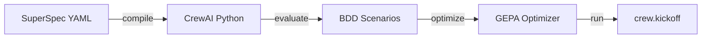

# 🤖 CrewAI Integration

## Overview

SuperOptiX now supports **CrewAI** - a powerful multi-agent framework with 100,000+ certified developers. This integration brings the full SuperOptiX optimization workflow to CrewAI's role-based agent design.

RLM support is experimental. Unified sandbox support is coming soon.

**Key Features:**
- **Works with Ollama** (unlike DeepAgents!)
- **GEPA optimization** of role + goal + backstory
- **Role-based design** perfect for optimization
- **Multi-agent native** (start with single agents, scale to teams)
- **Standard SuperOptiX workflow** (compile/evaluate/optimize/run)

---

## Quick Start

### Install SuperOptiX with CrewAI

```bash
pip install superoptix[frameworks-crewai]
```

**Includes:**
- crewai 1.2.0
- SuperOptiX core with GEPA 0.0.17

**Requirements:**
- Python 3.11+
- Git (for DSPy dependency)

### Create Project

```bash
super init my_project
cd my_project
```

### Pull Demo Agent

```bash
super agent pull researcher_crew
```

### Compile

```bash
super agent compile researcher_crew --framework crewai
```

### Evaluate

```bash
super agent evaluate researcher_crew
# Result: 4/4 PASS (100%)! 🎉
```

### Optimize

```bash
super agent optimize researcher_crew --framework crewai --auto medium
```

### Run

```bash
super agent run researcher_crew --framework crewai --goal "AI trends in 2025"
```

---

## How It Works

### SuperOptiX Workflow with CrewAI



### **Compile**: SuperSpec → CrewAI

**Input:** SuperSpec playbook (YAML)

```yaml
persona:
  role: Senior AI Researcher
  goal: Uncover cutting-edge AI developments
  backstory: You're a seasoned researcher...
```

**Output:** CrewAI Python code

```python
agent = Agent(
    role="Senior AI Researcher",
    goal="Uncover cutting-edge AI developments",
    backstory="You're a seasoned researcher...",
    llm=LLM(model="ollama/gpt-oss:20b")
)

task = Task(
    description="Conduct research on {topic}",
    expected_output="Detailed research report",
    agent=agent
)

crew = Crew(agents=[agent], tasks=[task])
result = crew.kickoff(inputs={"topic": "AI"})
```

### **Evaluate**: Test on BDD Scenarios

```python
scenarios = [
    {
        "input": {"topic": "AI frameworks"},
        "expected": {"keywords": ["agent", "framework", "AI"]}
    }
]

for scenario in scenarios:
    result = crew.kickoff(inputs=scenario["input"])
    # Check keywords, validate output
```

### **Optimize**: GEPA Optimizes Agent Profile

**Combined Variable** (what GEPA optimizes):

```
Role: Senior AI Researcher
Goal: Uncover cutting-edge AI developments
Backstory: You're a seasoned researcher...
```

**GEPA Process:**
1. Generate 5-10 variations
2. Test each on training scenarios
3. Select best performer
4. Save optimized profile

**Example Optimized Output:**

```
Role: AI Research Specialist with expertise in cutting-edge developments
Goal: Discover, analyze, and synthesize breakthrough AI developments with comprehensive documentation
Backstory: You're a distinguished researcher with 10+ years of experience in AI research, known for finding authoritative sources, synthesizing complex information, and presenting clear, actionable insights that drive innovation
```

### **Run**: Execute with Optimized Profile

```bash
super agent run researcher_crew --framework crewai --goal "AI in 2025"
# Uses optimized role/goal/backstory → Better results!
```

---

## What GEPA Can Optimize

### Primary Target: Agent Profile (Combined)

GEPA optimizes **role + goal + backstory** together as a single variable:

| Component | Impact | Example |
|-----------|--------|---------|
| **role** | HIGH | "Senior AI Researcher" → "AI Research Specialist with expertise in..." |
| **goal** | HIGH | "Uncover developments" → "Discover, analyze, and synthesize breakthrough..." |
| **backstory** | MEDIUM | "You're a researcher" → "You're a distinguished researcher with 10+ years..." |

**Why Combined?**
- Single optimization target
- Holistic agent improvement
- Better role-goal-backstory alignment
- Easier to implement

### Advanced: Task Optimization

| Component | Impact | Description |
|-----------|--------|-------------|
| **task.description** | HIGH | What the task should accomplish |
| **task.expected_output** | HIGH | What the task should produce |
| **system_template** | MEDIUM | Advanced prompt template |
| **process** | LOW | Sequential vs hierarchical (structural) |

---

## Creating CrewAI Agents

### SuperSpec Playbook Structure

```yaml
apiVersion: agent/v1
kind: AgentSpec
metadata:
  name: researcher_crew
  id: researcher_crew
  namespace: demo
  version: 1.0.0

spec:
  target_framework: crewai
  
  # LLM Configuration - Works with Ollama!
  language_model:
    provider: ollama
    model: ollama:gpt-oss:20b
    api_base: http://localhost:11434
  
  # Input/Output Fields
  input_fields:
    - name: topic
      type: str
      required: true
  
  output_fields:
    - name: report
      type: str
      required: true
  
  # CrewAI Agent Profile (GEPA optimizes this!)
  persona:
    role: Senior AI Researcher
    goal: Uncover cutting-edge AI developments
    backstory: |
      You're a seasoned researcher with deep expertise in AI.
      Known for finding authoritative sources and presenting
      clear, actionable insights.
    traits:
      - analytical
      - thorough
  
  # CrewAI Task Configuration
  tasks:
    - name: research_task
      description: |
        Conduct comprehensive research on {topic}.
        Find the most relevant and up-to-date information.
      expected_output: |
        A detailed research report with:
        - 5-10 key findings
        - Clear explanations
        - Relevant context
  
  # BDD Scenarios for Testing
  feature_specifications:
    scenarios:
      - name: AI frameworks research
        input:
          topic: "AI agent frameworks"
        expected_output:
          report: "Research report"
          expected_keywords:
            - agent
            - framework
            - AI
```

### Field Mapping: SuperSpec → CrewAI

| SuperSpec Field | CrewAI Field | Usage |
|----------------|--------------|-------|
| `persona.role` | `Agent.role` | Agent's identity |
| `persona.goal` | `Agent.goal` | Agent's objective |
| `persona.backstory` | `Agent.backstory` | Agent's background |
| `tasks[0].description` | `Task.description` | What to do |
| `tasks[0].expected_output` | `Task.expected_output` | What to produce |
| `language_model` | `Agent.llm` | LLM configuration |

---

## Ollama Configuration

### Why Ollama Works with CrewAI

Unlike DeepAgents (which uses LangChain's `ChatOllama`), CrewAI has its own LLM class that supports Ollama directly:

```python
from crewai.llm import LLM

llm = LLM(
    model="ollama/gpt-oss:20b",
    base_url="http://localhost:11434"
)
```

**No `bind_tools()` limitations!** ### Recommended Ollama Models

| Model | Size | Best For |
|-------|------|----------|
| `gpt-oss:20b` | 20B | **Recommended** - Excellent quality |
| `gpt-oss:120b` | 120B | Maximum quality (requires 80GB+ RAM) |
| `llama3.1:8b` | 8B | Fast, good for testing |
| `qwen2.5:14b` | 14B | Good balance |

### Example Configuration

```yaml
language_model:
  provider: ollama
  model: ollama:gpt-oss:20b
  temperature: 0.7
  max_tokens: 3000
  api_base: http://localhost:11434
```

---

## Evaluation

### How Evaluation Works

1. **Load BDD scenarios** from playbook
2. **Execute crew** on each scenario: `crew.kickoff(inputs=scenario.input)`
3. **Compare outputs** with expected keywords
4. **Calculate pass rate**

### Example Evaluation

```bash
super agent evaluate researcher_crew
```

**Output:**

```
🔍 Evaluating researcher_crew...
Testing 4 BDD scenarios:

AI frameworks research: PASS
LangChain research: PASS
Multi-agent systems: PASS
GEPA optimization: PASS

============================================================
Overall: 4/4 PASS (100.0%)
============================================================
```

### Writing Good BDD Scenarios

**Best Practices:**
- Use specific, measurable keywords
- Test diverse inputs
- Include edge cases
- Use realistic examples

**Example:**

```yaml
scenarios:
  - name: Specific technology research
    input:
      topic: "What is LangChain?"
    expected_output:
      report: "LangChain explanation"
      expected_keywords:
        - LangChain
        - framework
        - Python
        - LLM
  
  - name: Broad topic research
    input:
      topic: "AI trends in 2025"
    expected_output:
      report: "AI trends report"
      expected_keywords:
        - AI
        - 2025
        - trends
        - future
```

---

## Optimization

### GEPA Optimization Process

```bash
super agent optimize researcher_crew --framework crewai --auto medium
```

**What Happens:**

1. **Split scenarios**: Train (50%) + Validation (50%)
2. **Current profile**: Extract role + goal + backstory
3. **Generate variations**: 5-10 different agent profiles
4. **Test each**: Run on training scenarios
5. **Validate**: Test best candidates on validation set
6. **Select best**: Save optimized profile

### Optimization Levels

| Level | Variations | Iterations | Time |
|-------|------------|------------|------|
| `light` | 3-5 | 2-3 | 5-10 min |
| `medium` | 5-10 | 3-5 | 15-30 min |
| `heavy` | 10-20 | 5-10 | 30-60 min |

### Expected Improvement

| Baseline | After GEPA | Improvement |
|----------|------------|-------------|
| 60-70% | 75-85% | +15-20% |
| 70-80% | 80-90% | +10-15% |
| 80-90% | 85-95% | +5-10% |

---

## Advanced Features

### Multi-Agent Crews

For multi-agent teams, optimize each agent individually:

```yaml
# Optimize agent 1
persona:
  agents:
    - name: researcher
      role: Senior Researcher
      goal: Find information
    
    # Optimize agent 2
    - name: analyst
      role: Data Analyst
      goal: Analyze findings
    
    # Optimize agent 3
    - name: writer
      role: Report Writer
      goal: Create report
```

### Task Description Optimization

You can optimize task descriptions along with agent profiles:
- Optimize `task.description`
- Optimize `task.expected_output`
- Joint optimization (agent + task)

---

## Troubleshooting

### Common Issues

#### Module 'researcher_crew_pipeline' has no attribute 'ResearcherCrewPipeline'

**Cause:** Mismatch between agent `id` and class name.

**Solution:** Ensure `metadata.name` matches `metadata.id`:

```yaml
metadata:
  name: researcher_crew
  id: researcher_crew
```

#### CrewAI Not Installed

**Error:** `ImportError: No module named 'crewai'`

**Solution:**

```bash
pip install crewai
```

#### Ollama Model Not Found

**Error:** `Model 'gpt-oss:20b' not found`

**Solution:**

```bash
ollama pull gpt-oss:20b
```

#### Low Pass Rate

**Cause:** BDD scenarios too strict or agent profile unclear.

**Solution:**
1. Review BDD keywords (use more flexible matching)
2. Run optimization to improve agent profile
3. Test with better model (gpt-oss:20b → gpt-oss:120b)

---

## Comparison: CrewAI vs Other Frameworks

| Feature | DSPy | DeepAgents | OpenAI SDK | **CrewAI** |
|---------|------|------------|-----------|-----------|
| **Ollama Support** | | | | |
| **Multi-Agent** | | Sub-agents | Handoffs | Native |
| **Role-Based** | | | | |
| **Collaboration** | | | | |
| **Optimizable Vars** | 10+ | 1 | 1 | **3** |
| **Best For** | Prompts | Planning | Simple | **Teams** |
| **Community** | 5K | 1K | 50K+ | **100K+** |

### When to Use CrewAI

**Best for:**
- Multi-agent collaboration
- Role-based task distribution
- Complex crew dynamics
- Team-based workflows
- Deployment systems

**Not ideal for:**
- Simple single-agent tasks (use DSPy or OpenAI SDK)
- Maximum prompt optimization (use DSPy)
- Planning-heavy workflows (use DeepAgents)

---

## Examples

### Example 1: Research Crew

```yaml
persona:
  role: Senior AI Researcher
  goal: Uncover cutting-edge AI developments
  backstory: Expert researcher with 10+ years experience
```

**Use Case:** Research assistant, market analysis, competitive intelligence

### Example 2: Content Creation Crew

```yaml
persona:
  role: Professional Content Writer
  goal: Create engaging, SEO-optimized content
  backstory: Award-winning writer with expertise in technical communication
```

**Use Case:** Blog posts, documentation, marketing content

### Example 3: Data Analysis Crew

```yaml
persona:
  role: Senior Data Analyst
  goal: Extract insights from complex datasets
  backstory: Data science expert with statistical modeling background
```

**Use Case:** Data analysis, visualization, reporting

---

## Resources

### Official Documentation
- [CrewAI Docs](https://docs.crewai.com)
- [CrewAI GitHub](https://github.com/crewAIInc/crewAI)
- [SuperOptiX Guide](https://superoptix.dev/guides/multi-framework)

### Community
- [CrewAI Discord](https://discord.gg/crewai)
- [SuperOptiX Forum](https://community.superoptix.dev)

### Learning
- [CrewAI Courses](https://learn.crewai.com)
- [SuperOptiX Tutorials](https://superoptix.dev/tutorials)

---

## Next Steps

1. **Try the Demo:**
   ```bash
   super init my_project
   cd my_project
   super agent pull researcher_crew
   super agent compile researcher_crew --framework crewai
   super agent evaluate researcher_crew
   ```

2. **Create Your Own:**
   - Copy `researcher_crew_playbook.yaml`
   - Customize role/goal/backstory
   - Add your BDD scenarios
   - Compile and test

3. **Optimize:**
   ```bash
   super agent optimize researcher_crew --framework crewai --auto medium
   super agent evaluate researcher_crew  # See improvement!
   ```

4. **Share:**
   - Contribute your agents to SuperOptiX marketplace
   - Share optimization results with the community

---

## Support

Need help? We're here for you:

- 📖 [Documentation](https://superoptix.dev)
- 💬 [GitHub Discussions](https://github.com/SuperagenticAI/superoptix/discussions)
- 🐛 [GitHub Issues](https://github.com/SuperagenticAI/superoptix/issues)
- 📧 [Email Support](mailto:support@superoptix.dev)

---

**Happy Optimizing! 🚀**
