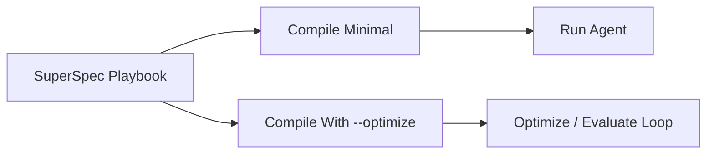

# Golden Workflow

This is the default workflow for SuperOptiX across frameworks.

## Core Sequence

```bash
# Pull demo or existing agent
super agent pull <agent_id>

# Compile minimal framework-native pipeline
super agent compile <agent_id> --framework <framework>

# Run minimal pipeline
super agent run <agent_id> --framework <framework> --goal "your goal"
```

## Optimization Sequence

Only use this when you want optimization/evaluation lifecycle code paths.

```bash
# Compile optimize-capable pipeline
super agent compile <agent_id> --framework <framework> --optimize

# Run GEPA loop
super agent optimize <agent_id> --framework <framework> --auto light
```

## Local vs Cloud

```bash
# Local
super agent run <agent_id> --framework <framework> --local --provider ollama --model llama3.1:8b --goal "..."

# Cloud (Google)
super agent run <agent_id> --framework <framework> --cloud --provider google-genai --model gemini-2.5-flash --goal "..."
```

## Required API Keys

- `google-genai`: `GOOGLE_API_KEY`
- `openai`: `OPENAI_API_KEY`
- `anthropic` / `claude-sdk`: `ANTHROPIC_API_KEY`
- `stackone` tools: `STACKONE_API_KEY` and usually `STACKONE_ACCOUNT_IDS`

## Minimal vs Optimize



## Framework Names

Use these values with `--framework`:

- `dspy`
- `openai`
- `claude-sdk`
- `pydantic-ai`
- `crewai`
- `google-adk`
- `deepagents`
- `microsoft` (legacy support)
