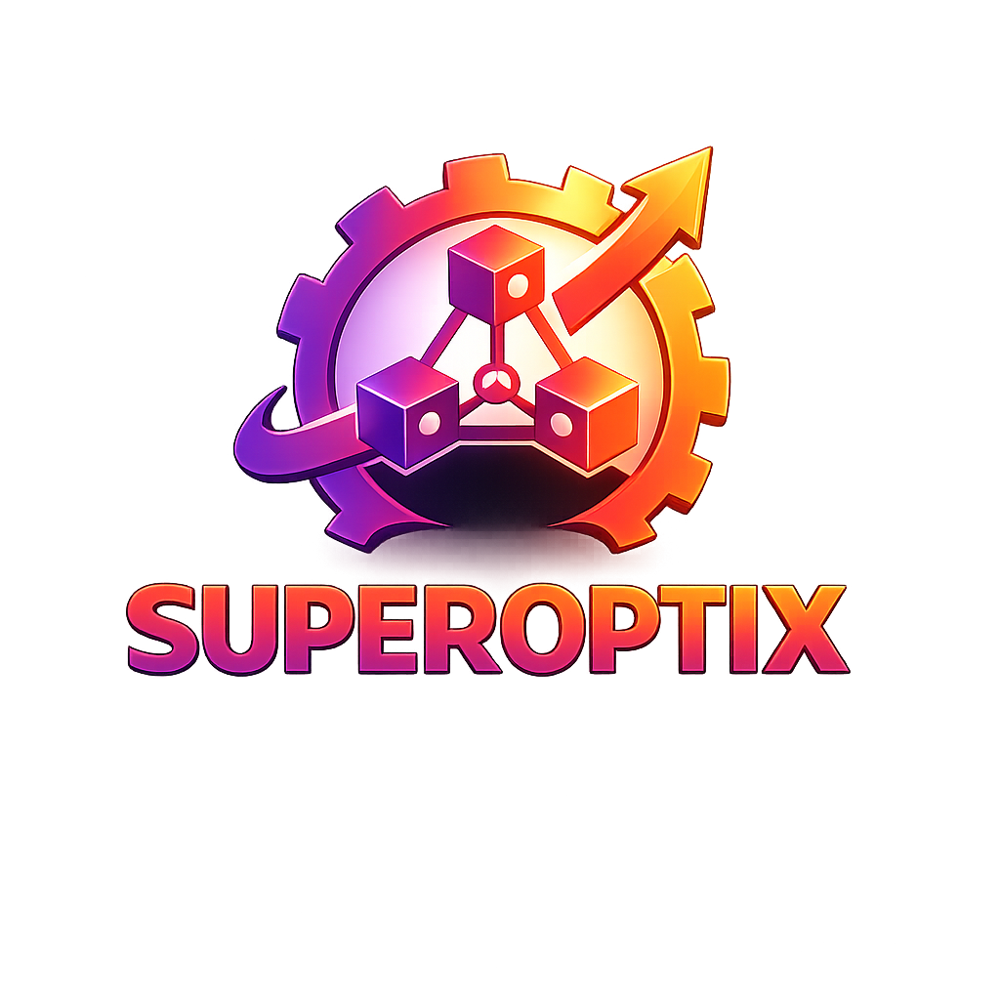

<div align="center">
  
  <h1 style="margin-top: 10px; margin-bottom: 10px;">SUPEROPTIX AI</h1>
  <h3 style="margin-top: 5px; margin-bottom: 15px;">Agent-to-Agent (A2A) Interoperability and Optimization Layer</h3>
  <p style="margin-top: 10px; margin-bottom: 10px;"><strong>Make the agents you already run A2A-compliant, and get them discovered.</strong></p>
  <p style="margin-top: 5px; margin-bottom: 10px;"><em>Powered by DSPy. Refined by Superagentic AI.</em></p>
  <p style="margin-top: 10px; margin-bottom: 20px;">Adapt an existing agent to A2A 1.0 without rewriting it, then measure and improve how other agents find it.</p>
</div>

<div align="center" style="margin: 30px 0;">
  <a href="guides/a2a-adapt/" style="background: #1976d2; color: white; padding: 12px 24px; text-decoration: none; border-radius: 4px; margin: 5px; display: inline-block; font-weight: bold;">Adapt an Agent</a>
  <a href="guides/a2a-conformance/" style="background: #424242; color: white; padding: 12px 24px; text-decoration: none; border-radius: 4px; margin: 5px; display: inline-block; font-weight: bold;">Conformance</a>
  <a href="guides/a2a-routing/" style="background: #424242; color: white; padding: 12px 24px; text-decoration: none; border-radius: 4px; margin: 5px; display: inline-block; font-weight: bold;">Routing Quality</a>
  <a href="quick-start/" style="background: #424242; color: white; padding: 12px 24px; text-decoration: none; border-radius: 4px; margin: 5px; display: inline-block; font-weight: bold;">Quick Start</a>
</div>

---

## What is SuperOptiX?

Agents built on different frameworks cannot call each other. A2A is the protocol that lets them, and SuperOptiX gives an agent an A2A interface without asking you to rewrite it.

Point it at an agent you already run. SuperOptiX reads its structure, works out the skills a calling agent would route on, and writes an Agent Card and a conformant server. Your code is not modified.

```bash
super a2a adapt --entrypoint mycrew:crew --framework crewai
uvicorn a2a.a2a_server:app --port 8000
```

Eight runtimes are supported: DSPy, CrewAI, the OpenAI Agents SDK, Pydantic AI, Google ADK, the Claude Agent SDK, DeepAgents and the Microsoft Agent Framework.

Being reachable is only half the problem. Whether another agent chooses to call yours depends on how its Agent Card describes it, so SuperOptiX measures that and improves it with GEPA. See [Routing quality](guides/a2a-routing/).

The protocol implementation scores 100% at MUST, SHOULD and MAY against the official A2A Technology Compatibility Kit, verified in CI. A live agent runs at [a2a.superoptix.ai](https://a2a.superoptix.ai). See [A2A conformance](guides/a2a-conformance/).

SuperOptiX also compiles agents from SuperSpec, a declarative YAML format, into native code for any supported runtime.

---

## Core Workflow

```bash
# Pull agent
super agent pull developer

# Compile minimal pipeline
super agent compile developer --framework dspy

# Run
super agent run developer --framework dspy --goal "Design a migration plan"

# Optional optimization path
super agent compile developer --framework dspy --optimize
super agent optimize developer --framework dspy --auto light
```

---

## What It Gives You

<table style="width: 100%; border-collapse: collapse; margin: 20px 0;">
  <tr>
    <td style="padding: 20px; border: 2px solid #2196F3; background: rgba(33, 150, 243, 0.08); vertical-align: top; width: 50%;">
      <h4 style="color: #2196F3; margin-top: 0;">Adaptation without a rewrite</h4>
      <ul>
        <li>One command reads an existing agent and writes its Agent Card and server</li>
        <li>Eight runtimes, including agents SuperOptiX did not build</li>
        <li>Your agent code is left unchanged</li>
      </ul>
    </td>
    <td style="padding: 20px; border: 2px solid #4CAF50; background: rgba(76, 175, 80, 0.08); vertical-align: top; width: 50%;">
      <h4 style="color: #4CAF50; margin-top: 0;">Verified conformance</h4>
      <ul>
        <li>100% MUST, SHOULD and MAY on the official A2A Technology Compatibility Kit</li>
        <li>The suite runs in CI with a 100% MUST floor</li>
        <li>A2A 1.0 and 0.3 served from one endpoint</li>
      </ul>
    </td>
  </tr>
  <tr>
    <td style="padding: 20px; border: 2px solid #FF9800; background: rgba(255, 152, 0, 0.08); vertical-align: top; width: 50%;">
      <h4 style="color: #FF9800; margin-top: 0;">Measured discoverability</h4>
      <ul>
        <li>Discovery, invocation and confusion rates over a query set</li>
        <li>GEPA rewrites skill descriptions against that score</li>
        <li>Agent behaviour is untouched, only the card changes</li>
      </ul>
    </td>
    <td style="padding: 20px; border: 2px solid #9C27B0; background: rgba(156, 39, 176, 0.08); vertical-align: top; width: 50%;">
      <h4 style="color: #9C27B0; margin-top: 0;">Compilation from a specification</h4>
      <ul>
        <li>One SuperSpec compiles to native code for any supported runtime</li>
        <li>Optional GEPA and DSPy optimization on the compile path</li>
        <li>BDD-style evaluation for repeatable quality checks</li>
      </ul>
    </td>
  </tr>
</table>

---

## Local and Cloud Routing

```bash
# Local Ollama
super agent run developer --framework dspy --local --provider ollama --model qwen3.5:9b --goal "..."

# Cloud Google
super agent run developer --framework dspy --cloud --provider google-genai --model gemini-3.7-flash --goal "..."
```

---

## Next Steps

- [Golden Workflow](guides/golden-workflow.md)
- [Troubleshooting by Symptom](guides/troubleshooting-by-symptom.md)
- [Framework Feature Matrix](guides/framework-feature-matrix.md)
- [CLI Complete Guide](guides/cli-complete-guide.md)
