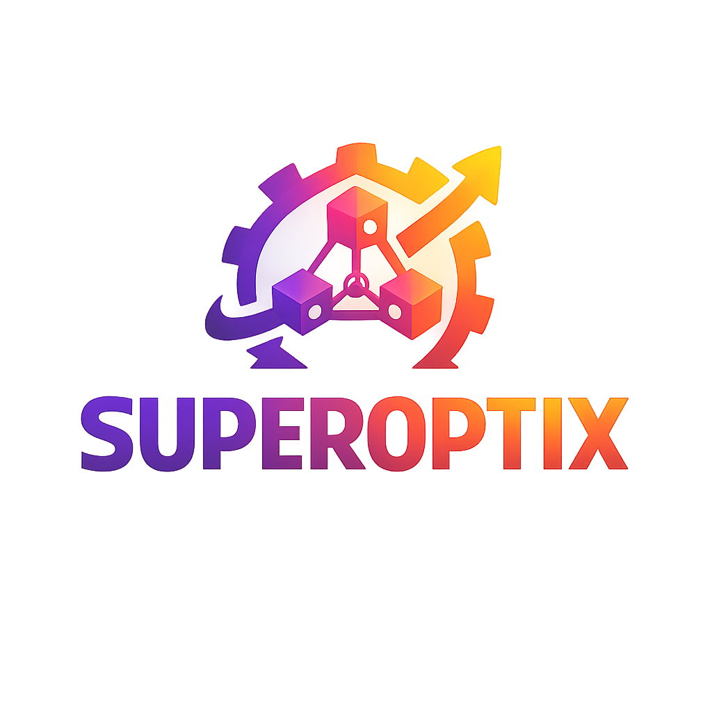

# 🏢 Superagentic AI

  
  <h2 style="margin-top: 10px; margin-bottom: 10px;">Superagentic AI</h2>
  
<strong>Building the future of autonomous AI systems</strong>

  <a href="https://super-agentic.ai" style="background: #4CAF50; color: white; padding: 14px 28px; text-decoration: none; border-radius: 4px; margin: 5px; display: inline-block; font-weight: bold;">🌐 Visit Website</a>
  <a href="../quick-start/" style="background: #2196F3; color: white; padding: 14px 28px; text-decoration: none; border-radius: 4px; margin: 5px; display: inline-block; font-weight: bold;">🚀 Get Started</a>
  <a href="../guides/" style="background: #FF9800; color: white; padding: 14px 28px; text-decoration: none; border-radius: 4px; margin: 5px; display: inline-block; font-weight: bold;">📚 Documentation</a>

---

## 🎯 Who We Are

**Superagentic AI** is the full-stack agentic AI company behind **SuperOptiX**, pioneering a safer, future-ready AI ecosystem through innovative foundational pillars.

As a full-stack agentic AI company, we are building **SuperOptiX** - a comprehensive framework designed to create production-worthy AI agents that embody our vision for the future of autonomous AI systems.

---

## 🏗️ Our Mission

SuperOptiX is more than just another AI framework, it's the embodiment of our commitment to building a safer, more intelligent, and more collaborative AI future. Our mission is to provide developers and organizations with the tools they need to create AI agents that are:

<table style="width: 100%; border-collapse: collapse;">
  <tr>
    <td style="padding: 20px; text-align: center; width: 20%; border: 2px solid rgba(76, 175, 80, 0.3); background: rgba(76, 175, 80, 0.05);">
      <h2>🔒</h2>
      <h4>Production-Ready</h4>
      
Built for real-world deployment at scale

    </td>
    <td style="padding: 20px; text-align: center; width: 20%; border: 2px solid rgba(33, 150, 243, 0.3); background: rgba(33, 150, 243, 0.05);">
      <h2>⚡</h2>
      <h4>Performance-Optimized</h4>
      
Designed with optimization as a first-class concern

    </td>
    <td style="padding: 20px; text-align: center; width: 20%; border: 2px solid rgba(255, 152, 0, 0.3); background: rgba(255, 152, 0, 0.05);">
      <h2>🛡️</h2>
      <h4>Secure & Safe</h4>
      
Enterprise-grade security and safety measures

    </td>
    <td style="padding: 20px; text-align: center; width: 20%; border: 2px solid rgba(156, 39, 176, 0.3); background: rgba(156, 39, 176, 0.05);">
      <h2>🤝</h2>
      <h4>Human-Collaborative</h4>
      
Designed for seamless human-AI interaction

    </td>
    <td style="padding: 20px; text-align: center; width: 20%; border: 2px solid rgba(76, 175, 80, 0.3); background: rgba(76, 175, 80, 0.05);">
      <h2>🌐</h2>
      <h4>Scalable</h4>
      
Ready to grow with your organization

    </td>
  </tr>
</table>

---

## 🚀 SuperOptiX: Our Flagship Product

**SuperOptiX** is the revolutionary AI agent framework built by Superagentic AI. The framework's first two tiers, **Oracles** and **Genies**, are now available, making advanced AI agent capabilities accessible to the broader developer community.

### 💎 Key Features

<table style="width: 100%; border-collapse: collapse;">
  <tr>
    <td style="padding: 20px; width: 50%; vertical-align: top; border: 2px solid rgba(76, 175, 80, 0.3); background: rgba(76, 175, 80, 0.05);">
      <h3 style="color: #4CAF50;">💎 SuperSpec DSL</h3>
      
<strong>Declarative agent specification</strong> with rapid development, type safety, and extensibility. Build complex agents in minutes, not days.

    </td>
    <td style="padding: 20px; width: 50%; vertical-align: top; border: 2px solid rgba(33, 150, 243, 0.3); background: rgba(33, 150, 243, 0.05);">
      <h3 style="color: #2196F3;">🏗️ Agent Pipelines</h3>
      
<strong>Automated workflows</strong> with custom agent building, secure coding practices, and seamless CI/CD integration.

    </td>
  </tr>
  <tr>
    <td style="padding: 20px; width: 50%; vertical-align: top; border: 2px solid rgba(255, 152, 0, 0.3); background: rgba(255, 152, 0, 0.05);">
      <h3 style="color: #FF9800;">🧠 Memory Systems</h3>
      
<strong>Multi-modal memory</strong> with ChromaDB, LanceDB, Weaviate, Qdrant, Milvus support. Intelligent context management and long-term learning.

    </td>
    <td style="padding: 20px; width: 50%; vertical-align: top; border: 2px solid rgba(156, 39, 176, 0.3); background: rgba(156, 39, 176, 0.05);">
      <h3 style="color: #9C27B0;">🔍 RAG Integration</h3>
      
<strong>Vector database support</strong> with automated document processing, semantic search, and centralized knowledge management.

    </td>
  </tr>
  <tr>
    <td style="padding: 20px; width: 50%; vertical-align: top; border: 2px solid rgba(76, 175, 80, 0.3); background: rgba(76, 175, 80, 0.05);">
      <h3 style="color: #4CAF50;">🛠️ Tool Ecosystem</h3>
      
<strong>Built-in and custom tools</strong> with intelligent tool orchestration and seamless API integration.

    </td>
    <td style="padding: 20px; width: 50%; vertical-align: top; border: 2px solid rgba(33, 150, 243, 0.3); background: rgba(33, 150, 243, 0.05);">
      <h3 style="color: #2196F3;">📊 Observability</h3>
      
<strong>Real-time monitoring</strong> with advanced debugging, performance analytics, and complete audit trails.

    </td>
  </tr>
  <tr>
    <td style="padding: 20px; width: 50%; vertical-align: top; border: 2px solid rgba(255, 152, 0, 0.3); background: rgba(255, 152, 0, 0.05);">
      <h3 style="color: #FF9800;">🎼 Multi-Agent Orchestration</h3>
      
<strong>Agent teams</strong> with complex workflow management, resource optimization, and scalable architecture.

    </td>
    <td style="padding: 20px; width: 50%; vertical-align: top; border: 2px solid rgba(156, 39, 176, 0.3); background: rgba(156, 39, 176, 0.05);">
      <h3 style="color: #9C27B0;">🧬 GEPA Optimizer</h3>
      
<strong>Universal optimization</strong> across all frameworks with proven 37.5% → 80% improvements.

    </td>
  </tr>
</table>

## 🏗️ Our Foundational Pillars

We're building the future of AI through five core pillars that form the backbone of our vision:

### 🤖 Agentic DevOps
Streamlined development and deployment of AI agents with enterprise-grade infrastructure, automated testing, and continuous integration/continuous deployment (CI/CD) pipelines designed specifically for autonomous AI systems.

### ⚙️ Agent Engineering
Advanced tools and methodologies for building production-worthy agents. This includes:

- **Development Frameworks** - Comprehensive tooling for agent creation

- **Testing & Validation** - Robust testing methodologies for AI agents

- **Performance Optimization** - Tools to ensure optimal agent performance

- **Security & Safety** - Built-in safeguards and security measures

### 🎯 Agent Experience (AgentEx)
Just as UX is designed for humans and DevEx for developers, **AgentEx** is designed for autonomous AI agents. It's about creating environments, interfaces, and systems that agents can effectively navigate, understand, and utilize.

AgentEx isn't just a nice-to-have. As agents become more prevalent in building and using software, the quality of their experience directly impacts their effectiveness, reliability, and safety.

**Key AgentEx Principles:**
- **Intuitive Interfaces** - Environments that agents can easily understand and navigate
- **Efficient Communication** - Optimized protocols for agent-to-agent and agent-to-human interaction
- **Contextual Awareness** - Systems that provide agents with the right information at the right time
- **Performance Optimization** - Interfaces designed for speed and efficiency

### 🤝 Agentic Co-Intelligence
The idea that humans and agents must evolve together - as orchestrators, trainers, validators, and high-context collaborators. This pillar focuses on:

- **Human-AI Collaboration** - Seamless interaction between humans and AI agents
- **Training & Validation** - Human oversight and guidance for AI systems
- **Orchestration** - Coordinated workflows between multiple agents and humans
- **High-Context Understanding** - Deep comprehension of human intent and business context

### 🔮 Quantum AI
Next-generation quantum computing integration for AI systems, exploring the intersection of quantum computing and artificial intelligence to unlock new capabilities and performance improvements.

## 🏗️ SuperOptiX Tiers & Pillar Alignment

SuperOptiX is structured in tiers that progressively embody our foundational pillars, with the first two tiers - **Oracles** and **Genies** - now available:

| Tier | Description | Superagentic AI Pillars | Status |
|------|-------------|-------------------------|---------|
| **🔮 Oracles** | High-level reasoning and decision-making agents with advanced context understanding | **Context Engineering** + **Agent Engineering** | **Available** |
| **🧞 Genies** | Task-oriented agents with specialized capabilities and tool integration | **Agent Engineering** | **Open Source** |
| **🔗 Protocols** | Multi-agent communication and orchestration layer | **Agent Experience** | 🔄 **Coming Soon** |
| **🤝 SuperAgents** | Advanced human-AI collaboration with human-in-the-loop capabilities | **Agentic Co-Intelligence** | 🔄 **Coming Soon** |
| **🔮 Quantum Agents** | Next-generation agents leveraging quantum computing capabilities | **Quantum AI** | 🔮 **Future** |

### 🎯 Pillar Integration

- **⚙️ Context Engineering** - Implemented through SuperSpec DSL in Oracles tier
- **⚙️ Agent Engineering** - Core framework across Oracles and Genies tiers
- **🎯 Agent Experience** - Protocol layer for seamless agent communication
- **🤝 Agentic Co-Intelligence** - Human-in-the-loop capabilities in upper tiers
- **🔮 Quantum AI** - Future integration with quantum computing systems

## 🏗️ How SuperOptiX Embodies Our Pillars

### ⚙️ Agent Engineering
SuperOptiX provides comprehensive agent engineering capabilities through:

- **SuperSpec DSL** - Declarative agent specification language for rapid development
- **Automated Agent Pipelines** - Streamlined development workflows
- **Custom Agent Building** - Full developer control over agent behavior and capabilities
- **Secure Coding Practices** - Built-in security and validation frameworks

**Context Engineering** via SuperSpec (no-code/low-code)  
**Agent Engineering** via SuperSpec + Agent Pipelines (Developer + Business collaboration)

### 🎯 Agent Experience (AgentEx)
Just as UX is designed for humans and DevEx for developers, **AgentEx** is designed for autonomous AI agents. It's about creating environments, interfaces, and systems that agents can effectively navigate, understand, and utilize.

AgentEx isn't just a nice-to-have. As agents become more prevalent in building and using software, the quality of their experience directly impacts their effectiveness, reliability, and safety.

SuperOptiX provides pure-class agent experience through:
- **Protocol Layers** - Integration with MCP, A2A, and upcoming protocols
- **Multi-Agentic Systems** - Seamless agent-to-agent communication
- **Optimized Interfaces** - Purpose-built environments for AI agents

### 🤝 Agentic Co-Intelligence
Agentic Co-Intelligence is the idea that humans and agents must evolve together - as orchestrators, trainers, validators, and high-context collaborators.

SuperOptiX implements this through:
- **Human-in-the-Loop** - Upper-tier controls for human oversight
- **Behavioral Control** - Human-defined criteria for agent behavior
- **Collaborative Workflows** - Seamless human-AI interaction patterns

## 🎯 Our Vision

We envision a world where AI agents are:
- **Safe and Reliable** - Built with security and safety as core principles
- **Intelligent and Adaptive** - Capable of learning and evolving with their environment
- **Collaborative** - Working seamlessly with humans and other agents
- **Production-Ready** - Deployed at scale in real-world applications
- **Ethical** - Operating with transparency and accountability

## 🎯 Our Vision

We envision a world where AI agents are:

<table style="width: 100%; border-collapse: collapse; margin: 20px 0;">
  <tr style="background: rgba(33, 150, 243, 0.15); font-weight: bold;">
    <td style="padding: 15px; border: 2px solid rgba(128, 128, 128, 0.3);">Vision Element</td>
    <td style="padding: 15px; border: 2px solid rgba(128, 128, 128, 0.3);">Description</td>
  </tr>
  <tr style="background: rgba(76, 175, 80, 0.05);">
    <td style="padding: 12px; border: 2px solid rgba(128, 128, 128, 0.3);"><strong style="color: #4CAF50;">🔒 Safe and Reliable</strong></td>
    <td style="padding: 12px; border: 2px solid rgba(128, 128, 128, 0.3);">Built with security and safety as core principles</td>
  </tr>
  <tr style="background: rgba(33, 150, 243, 0.05);">
    <td style="padding: 12px; border: 2px solid rgba(128, 128, 128, 0.3);"><strong style="color: #2196F3;">🧠 Intelligent and Adaptive</strong></td>
    <td style="padding: 12px; border: 2px solid rgba(128, 128, 128, 0.3);">Capable of learning and evolving with their environment</td>
  </tr>
  <tr style="background: rgba(255, 152, 0, 0.05);">
    <td style="padding: 12px; border: 2px solid rgba(128, 128, 128, 0.3);"><strong style="color: #FF9800;">🤝 Collaborative</strong></td>
    <td style="padding: 12px; border: 2px solid rgba(128, 128, 128, 0.3);">Working seamlessly with humans and other agents</td>
  </tr>
  <tr style="background: rgba(156, 39, 176, 0.05);">
    <td style="padding: 12px; border: 2px solid rgba(128, 128, 128, 0.3);"><strong style="color: #9C27B0;">🚀 Production-Ready</strong></td>
    <td style="padding: 12px; border: 2px solid rgba(128, 128, 128, 0.3);">Deployed at scale in real-world applications</td>
  </tr>
  <tr style="background: rgba(76, 175, 80, 0.05);">
    <td style="padding: 12px; border: 2px solid rgba(128, 128, 128, 0.3);"><strong style="color: #4CAF50;">Ethical</strong></td>
    <td style="padding: 12px; border: 2px solid rgba(128, 128, 128, 0.3);">Operating with transparency and accountability</td>
  </tr>
</table>

---

## 🚀 Getting Started with SuperOptiX

Ready to build the future of AI agents?

<table style="width: 100%; border-collapse: collapse;">
  <tr>
    <td style="padding: 20px; text-align: center; width: 25%; border: 2px solid rgba(76, 175, 80, 0.3); background: rgba(76, 175, 80, 0.05);">
      <h2>📦</h2>
      <h4><a href="../setup/" style="color: #4CAF50; text-decoration: none; font-weight: bold;">Installation</a></h4>
      
Quick setup and installation

    </td>
    <td style="padding: 20px; text-align: center; width: 25%; border: 2px solid rgba(33, 150, 243, 0.3); background: rgba(33, 150, 243, 0.05);">
      <h2>🚀</h2>
      <h4><a href="../quick-start/" style="color: #2196F3; text-decoration: none; font-weight: bold;">Quick Start</a></h4>
      
Build your first agent in minutes

    </td>
    <td style="padding: 20px; text-align: center; width: 25%; border: 2px solid rgba(255, 152, 0, 0.3); background: rgba(255, 152, 0, 0.05);">
      <h2>📚</h2>
      <h4><a href="../guides/" style="color: #FF9800; text-decoration: none; font-weight: bold;">Documentation</a></h4>
      
Comprehensive guides and tutorials

    </td>
    <td style="padding: 20px; text-align: center; width: 25%; border: 2px solid rgba(156, 39, 176, 0.3); background: rgba(156, 39, 176, 0.05);">
      <h2>💎</h2>
      <h4><a href="../guides/superspec/" style="color: #9C27B0; text-decoration: none; font-weight: bold;">SuperSpec</a></h4>
      
Learn our declarative DSL

    </td>
  </tr>
</table>

---

## 📚 Learn More About Superagentic AI

  <a href="https://super-agentic.ai/super-agentic-cointelligence" style="background: #4CAF50; color: white; padding: 14px 28px; text-decoration: none; border-radius: 4px; margin: 5px; display: inline-block; font-weight: bold;">🤝 Agentic Co-Intelligence</a>
  <a href="https://super-agentic.ai/agent-experience" style="background: #2196F3; color: white; padding: 14px 28px; text-decoration: none; border-radius: 4px; margin: 5px; display: inline-block; font-weight: bold;">🎯 Agent Experience</a>
  <a href="https://super-agentic.ai/agent-engineering" style="background: #FF9800; color: white; padding: 14px 28px; text-decoration: none; border-radius: 4px; margin: 5px; display: inline-block; font-weight: bold;">⚙️ Agent Engineering</a>
  <a href="https://super-agentic.ai/resources/super-posts" style="background: #9C27B0; color: white; padding: 14px 28px; text-decoration: none; border-radius: 4px; margin: 5px; display: inline-block; font-weight: bold;">📖 Blog</a>

### 🎧 The Superagentic AI Show

Listen to our podcast on [Apple Podcasts](https://podcasts.apple.com/gb/podcast/the-superagentic-ai-show/id1816402510) for in-depth discussions about the future of AI and agentic systems.

---

  
<em>Superagentic AI is more than a company, we're a movement dedicated to building a safer, more intelligent, and more collaborative AI future. Join us in shaping the next generation of autonomous AI systems.</em>

  <a href="https://super-agentic.ai" style="background: #4CAF50; color: white; padding: 16px 32px; text-decoration: none; border-radius: 4px; margin: 10px; display: inline-block; font-weight: bold; font-size: 1.1em;">🌐 Visit Our Website</a>
  <a href="../quick-start/" style="background: #2196F3; color: white; padding: 16px 32px; text-decoration: none; border-radius: 4px; margin: 10px; display: inline-block; font-weight: bold; font-size: 1.1em;">🚀 Try SuperOptiX Free</a>

 